# Maktaba for Gemini

**Turn your linear chat history into a structured knowledge base.**

## A. Overview

Native AI interfaces default to a linear, chronological list with limited navigation and organization options. This creates bottlenecks when working on multi-threaded projects in retriving specific chats when aiming to utilize more than just the AI system context.

**Maktaba** ("Library" in Swahili) solves this by adding a local-first organizational layer to Google Gemini, allowing you to folder, tag, and search your chats without losing context.

## B. Features

- **📁 Project Structure:** Create nested folders to organize chats by context, not just date.
- **🏷️ Tags & Notes:** Add searchable tags (`#strategy`) and annotation notes to any chat.
- **🔍 Power Search:** Regex-based search with phrase exclusion support (`-"market analysis"`).
- **🛡️ Local & Private:** All metadata is stored in your browser's `chrome.storage.sync`. No external servers.
- **💾 Data Portable:** Export your library to **JSON** (backup), **CSV** (analysis), or **Markdown** (for Obsidian/Notion).

## C. Installation Guide

### C.1. Manual Mode (Developer)

1. Clone this repository.
2. Navigate to chrome://extensions/ and enable Developer Mode.
3. Click Load Unpacked and select the /src folder.
4. Refresh Gemini to see the sidebar.

### C.2. Chrome Web Store

Link coming soon pending review.

## D. Directory Structure

```text
├── .github/                # Issue templates and GitHub workflows
├── docs/                   # Documentation
│   ├── ADR/                # Architecture Decision Records
│   └── Prompts/            # System prompts used for refactoring & i18n
│   └── store_assets/       # Assets from Chrome Web Store and other platforms
├── src/                    # Source code
│   ├── _locales/           # i18n JSON files for internationalization
│   ├── content.js          # Main logic interacting with the DOM
│   ├── manifest.json       # Chrome Extension configuration
│   └── styles.css          # UI styling
├── CONTRIBUTING.md         # Guidelines for contributors
├── LICENSE.md              # Software license
├── PRIVACY.md              # Privacy policy
├── CONTRIBUTING.md         # Guidelines for contributors
└── README.md
```

## E. How it Works

### E.1. Saving Workflows

Maktaba provides three distinct ways to capture knowledge, depending on your workflow context.


<details> <summary><strong>View Detailed Logic (Quick Save, Folder +, Link Import)</strong></summary>

#### E.1.1 Quick Save (Floating Button)

Used when you are inside an active chat and want to save it without breaking flow.


#### E.1.2 Contextual Save (Folder '+')

Used when organizing from the sidebar and you want to add the current chat to a specific project.

```mermaid
flowchart TD
    A[User clicks Folder “+”] --> B{Chat already in folder?}
    B -- Yes --> C[Show message that already added]
    B -- No --> D[Add tags & notes]
    D --> E[Save chat]
    E --> F[Chat appears in that folder]
```



#### E.1.3 External Link Import (Folder '🔗')

Used to add a chat URL (e.g., from someone else or history) directly into a folder.

```mermaid
flowchart TD
    A0[User clicks Folder “🔗”] --> A
    A[User pastes chat link] --> B{Link valid?}
    B -- No --> C[Show error message]
    B -- Yes --> D[Add title, tags & notes]
    D --> E[Save chat]
    E --> F[Chat appears in that folder]
```



</details>

### E.2. Data Safety & Management

Data integrity and portability is prioritized.


### E.3. Architecture: The Flyweight Pattern

To navigate the [100KB](https://developer.chrome.com/docs/extensions/mv2/reference/storage) storage limit of chrome.storage.sync, a normalized schema is used. Chat metadata is decoupled from the folder tree, allowing a single chat to exist in multiple folders (symlinks) with zero data redundancy.


### E.4. Real-Time Sync

We use an observer pattern on chrome.storage.onChanged. If you organize a chat in Tab A, Tab B updates instantly without a refresh across devices.


## F. Support

> - **Have questions?** Check the **[Frequently Asked Questions (FAQs)](docs/FAQs.md)** for details on storage limits and privacy.
> - **Found a bug or have an idea?** Navigate to the Issues tab and select one of the templates (Bug Report or Feature Request) then share your feedback.
> - **Want to contribute?** See **[CONTRIBUTING.md](CONTRIBUTING.md)** and review the Architecture Decision Records in `docs/ADR`.

LLM translation of message.json ongoing

## G. License

[MIT License.md](LICENSE.md)

Code and Docs made with [Gemini](https://gemini.google.com/)
